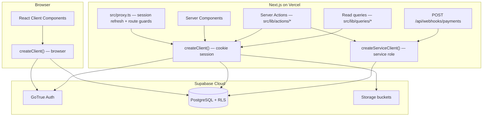
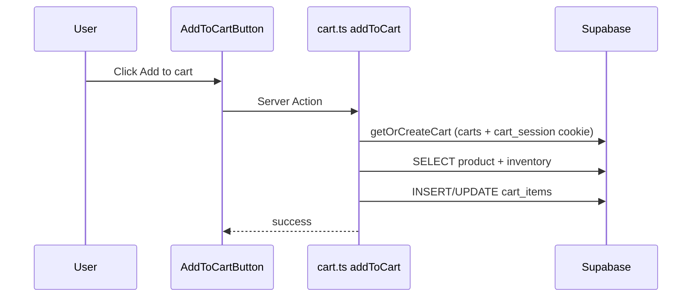

# Shopping Kraft — Architecture

Full-stack ecommerce built with **Next.js 16**, **Supabase**, and **Vercel**. This document explains how Supabase connects to the app, what each folder does, and how data flows through the system.

## Stack

| Layer | Technology |
|-------|------------|
| Frontend | Next.js App Router, React 19, TypeScript, Tailwind CSS, shadcn/ui |
| Backend | Supabase (PostgreSQL, Auth, Storage, RLS) |
| Hosting | Vercel |
| E2E tests | Playwright |

---

## How Supabase connects to the app



### Three Supabase clients

All clients live in [`src/lib/supabase/`](../src/lib/supabase/).

| Client | File | Key | Purpose |
|--------|------|-----|---------|
| **Browser** | `client.ts` | `NEXT_PUBLIC_SUPABASE_ANON_KEY` | Client-side auth/UI (used sparingly; most logic is server-side) |
| **Server (user session)** | `server.ts` | anon key + cookies | Default for pages, queries, and actions — respects RLS as the logged-in user or anonymous visitor |
| **Service role** | `server.ts` → `createServiceClient()` | `SUPABASE_SERVICE_ROLE_KEY` | Bypasses RLS for admin-only operations (staff permissions, audit logs, payment webhooks) |

### Request lifecycle

1. **Every HTTP request** passes through [`src/proxy.ts`](../src/proxy.ts) (Next.js 16 proxy):
   - Refreshes the auth session via [`updateSession()`](../src/lib/supabase/middleware.ts)
   - Redirects unauthenticated users away from `/admin/*` and `/account/*`
   - Enforces staff permission checks per admin route

2. **Storefront reads** — [`src/lib/queries/storefront.ts`](../src/lib/queries/storefront.ts) uses the server client to SELECT products, categories, and cart data. RLS allows public read of the active catalog.

3. **Mutations** — [`src/lib/actions/`](../src/lib/actions/) are Server Actions that INSERT/UPDATE/DELETE data (cart, orders, admin CRUD). Admin actions call [`requirePermission()`](../src/lib/auth/session.ts) first.

4. **Database schema** — defined in [`supabase/migrations/`](../supabase/migrations/), applied with `npx supabase db push`. RLS in migration `002` controls who can read/write each table.

5. **Images** — uploaded to Supabase Storage; [`next.config.ts`](../next.config.ts) allows `*.supabase.co` hostnames for Next.js `<Image>`.

6. **Payment webhooks** — external providers POST to [`src/app/api/webhooks/payments/route.ts`](../src/app/api/webhooks/payments/route.ts), which uses the service client to update order/payment status.

---

## Supabase migrations

Migrations run in numeric order. Apply them with:

```bash
npx supabase link --project-ref YOUR_PROJECT_REF
npx supabase db push
```

| File | Purpose |
|------|---------|
| `001_core_schema.sql` | Core tables: `profiles`, `categories`, `products`, `product_images`, `product_variants`, `inventory`, `inventory_movements`, `addresses`, `carts`, `cart_items`, `orders`, `order_items`, `payments`, `coupons`, `coupon_usage`, `reviews`, `wishlists`, `banners`, `settings` |
| `002_rls_policies.sql` | Row Level Security policies. Public can browse active catalog; users own their cart/orders/profile; admins manage everything via `is_admin()` helper |
| `003_seed_admin.sql` | Instructions to promote the first registered user to admin role |
| `004_staff_permissions.sql` | `staff_permissions` table, `admin_audit_logs`, order tracking column, RLS for staff |
| `005_sale_campaigns.sql` | `sale_campaigns` and `sale_campaign_products` for flash/seasonal/clearance sales |
| `006_public_inventory_read.sql` | Allows storefront to read stock levels for active products (without this, all products show as out of stock) |

### Other Supabase files

| Path | Purpose |
|------|---------|
| `supabase/config.toml` | Local Supabase CLI configuration (ports, auth settings) |
| `supabase/.temp/` | CLI-generated local metadata (project ref, versions). **Do not commit** — listed in `.gitignore` |

---

## Frontend structure

### App routes (`src/app/`)

| Path | Purpose |
|------|---------|
| `(storefront)/` | Public shop: home, product, category, sale, search, shop, cart, checkout, account |
| `(auth)/` | Login and register pages |
| `admin/` | Admin panel: dashboard, CRUD for products/categories/orders/inventory/coupons/sales/reviews/banners/staff/settings |
| `api/webhooks/payments/` | Payment provider webhook endpoint |
| `not-found.tsx` | Global 404 page (storefront branding with Header/Footer) |
| `error.tsx` | Runtime error boundary (500-style fallback) for storefront routes |
| `global-error.tsx` | Last-resort error page when root layout fails |
| `layout.tsx` | Root layout: fonts, global styles, Toaster |
| `globals.css` | Tailwind theme, design tokens |

Admin-specific error pages:

| Path | Purpose |
|------|---------|
| `admin/not-found.tsx` | 404 for missing admin records |
| `admin/error.tsx` | Runtime error boundary for admin panel |

### Server Actions (`src/lib/actions/`)

Each file maps to one domain. All admin mutations check permissions via `requirePermission()`.

| File | Purpose |
|------|---------|
| `auth.ts` | Login, register, logout, profile update, address CRUD |
| `cart.ts` | Add/remove/update cart items, guest cart via `cart_session` cookie, merge on login |
| `orders.ts` | Checkout (`createOrder`), admin order status updates, order listing |
| `products.ts` | Admin product CRUD, image linking, inventory seeding |
| `categories.ts` | Admin category CRUD |
| `inventory.ts` | Stock adjustments and movement logging |
| `coupons.ts` | Coupon CRUD and validation at checkout |
| `sales.ts` | Sale campaign CRUD and product assignment |
| `banners.ts` | Homepage banner CRUD |
| `reviews.ts` | Review moderation |
| `staff.ts` | Staff member creation and permission management |
| `variants.ts` | Product variant CRUD |
| `analytics.ts` | Dashboard chart data aggregation |

### Queries (`src/lib/queries/`)

| File | Purpose |
|------|---------|
| `storefront.ts` | Read-only SELECT queries for categories, products, search, sales, banners, homepage data |

### Auth (`src/lib/auth/`)

| File | Purpose |
|------|---------|
| `session.ts` | `getAdminSession()`, `requirePermission()`, `logAdminAction()` |
| `permissions.ts` | Permission constants, route-to-permission mapping, staff permission normalization |

### Supabase clients (`src/lib/supabase/`)

| File | Purpose |
|------|---------|
| `client.ts` | Browser Supabase client |
| `server.ts` | Server client (cookie session) and service role client |
| `middleware.ts` | Session refresh helper used by `proxy.ts` |

### Other lib files

| Path | Purpose |
|------|---------|
| `lib/validators/schemas.ts` | Zod schemas for forms (login, product, checkout, etc.) |
| `lib/utils/format.ts` | Price formatting, order number generation, effective price calculation |
| `lib/utils.ts` | `cn()` classname helper |
| `lib/admin/list.ts` | Shared admin list/pagination helpers |
| `types/database.ts` | TypeScript types mirroring Supabase tables and enums |

### Components

| Path | Purpose |
|------|---------|
| `components/storefront/` | Shop UI: Header, Footer, ProductCard, CartItems, CheckoutForm, etc. |
| `components/admin/` | Admin UI: tables, forms, filters, pagination, charts |
| `components/auth/` | LoginForm, RegisterForm |
| `components/ui/` | shadcn/ui primitives (Button, Card, Input, etc.) |
| `components/shared/` | Shared cross-area components (ErrorPageShell) |

### Proxy / route guards

[`src/proxy.ts`](../src/proxy.ts) runs on every matched request:

- Refreshes Supabase auth cookies
- Blocks `/admin/*` for non-admin/staff users
- Blocks `/account/*` for unauthenticated users
- Redirects staff without permission to an allowed admin page

---

## Data flow examples

### User adds to cart



1. [`AddToCartButton`](../src/components/storefront/AddToCartButton.tsx) calls `addToCart()` server action.
2. [`cart.ts`](../src/lib/actions/cart.ts) gets or creates a cart (logged-in user ID or guest `cart_session` cookie).
3. Validates stock from `inventory` table.
4. Inserts or updates `cart_items` with effective price.

### Admin creates product

1. [`ProductForm`](../src/components/admin/ProductForm.tsx) submits to `createProduct()` in [`products.ts`](../src/lib/actions/products.ts).
2. `requirePermission("products.manage")` verifies admin/staff access.
3. Validates input with Zod `productSchema`.
4. Inserts into `products`, `inventory`, and optionally `product_images`.
5. `revalidatePath()` refreshes cached storefront and admin pages.

### Customer checkout

1. [`CheckoutForm`](../src/components/storefront/CheckoutForm.tsx) submits to `createOrder()` in [`orders.ts`](../src/lib/actions/orders.ts).
2. Loads cart items, validates stock, applies coupon if provided.
3. Creates `orders`, `order_items`, `payments`, and shipping address snapshot.
4. Decrements inventory and clears cart via `clearCart()`.
5. Redirects to order confirmation / account orders page.

---

## Environment variables

```bash
NEXT_PUBLIC_SUPABASE_URL=       # Supabase project URL
NEXT_PUBLIC_SUPABASE_ANON_KEY=  # Public anon key (safe for browser)
SUPABASE_SERVICE_ROLE_KEY=      # Server-only; bypasses RLS
NEXT_PUBLIC_SITE_URL=           # e.g. http://localhost:3000
PAYMENT_WEBHOOK_SECRET=         # Optional; secures payment webhook endpoint
```

Copy from `.env.local.example` and fill in values from your Supabase project dashboard.

---

## First-time setup

1. Create a Supabase project at [supabase.com](https://supabase.com).
2. Link and push migrations: `npx supabase link` then `npx supabase db push`.
3. Register a user at `/register`.
4. Promote to admin in Supabase SQL editor:

```sql
UPDATE profiles SET role = 'admin' WHERE id = '<your-user-uuid>';
```

5. Run locally: `npm run dev`.

---

## Error handling

| Scenario | Handler |
|----------|---------|
| Missing route or `notFound()` | `src/app/not-found.tsx` (storefront) or `src/app/admin/not-found.tsx` |
| Runtime error in a page | `src/app/error.tsx` or `src/app/admin/error.tsx` |
| Root layout crash | `src/app/global-error.tsx` |

All error pages use [`ErrorPageShell`](../src/components/shared/ErrorPageShell.tsx) for consistent branding.
